<!-- profile -->
<picture>
  <source media="(prefers-color-scheme: dark)" srcset="./assets/banner/dark.svg">
  <source media="(prefers-color-scheme: light)" srcset="./assets/banner/light.svg">
  
</picture>

 

<!-- streak section -->

  

<!-- tech stack -->
<h3 align="center">🛠️ Tech Stack</h3>

<!-- <b>Toolchain</b>   -->

<!--    -->

<!-- <b>Languages</b>   -->

<!--    -->

<!-- <b>Frontend</b>   -->

<!--    -->

<!-- <b>Backend</b>   -->

<!--    -->

<!-- <b>Database</b>   -->

<!--    -->

<!-- <b>Infrastructure</b>   -->

<!--    -->

<!-- github stats and language stats -->

  
  

<!-- contribution snake -->
<picture>
  <source
    media="(prefers-color-scheme: dark)"
    srcset="https://raw.githubusercontent.com/RajwardhanZambare/RajwardhanZambare/output/github-contribution-grid-snake-dark.svg"
  />
  <source
    media="(prefers-color-scheme: light)"
    srcset="https://raw.githubusercontent.com/RajwardhanZambare/RajwardhanZambare/output/github-contribution-grid-snake.svg"
  />
  
</picture>

<!-- contact section -->
<h3 align="center">Connect with me</h3>

  
  &nbsp;&nbsp;
  
  &nbsp;&nbsp;
  

